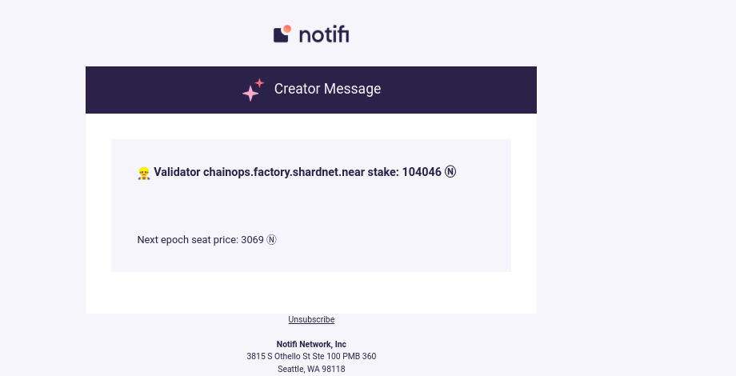

* In #integration-requests channel, ask to integrate a new validator on Near for Stake Wars!
* A support ticket will be created with you in it.
* You'll be asked for your valid testnet wallet, validator name, and email where you want test messages sent.
* Once approved, a moderator will send you credentials for your account. This is the sid/secret you’ll use in the SDK to authenticate from the validator. Keep these credentials safe and never shared.
* Use the SDK sample here to broadcast messages to a particular topic. The topic name will be provided to you when you get your sid/secret pair. https://github.com/notifi-network/notifi-sdk-ts/tree/main/packages/notifi-node-sample
* Use NotifiClient.sendBroadcastMessage to send your message via the provided topic name. For this challenge, you can leave targetTemplates as undefined, as we will use the default ones. Required variables are “subject” and “message”.


# Connect a node validator for sending notifications through Notifi

## Getting credentials

I got credentials on my e-mail on the second day after completeng form by link shared [#integration-requests](https://discord.com/invite/nAqR3mk3rv) in Discord channel.


## Apply script

```bash
git clone https://github.com/arkhiiipov/notifi-sdk-ts.git

cd notifi-near-integration

npm i

cp example.env .env

nano .env
```

```bash
POOL_ID="xx.factory.shardnet.near"
NODE_IP=127.0.0.1
SID=******************************
SECRET='****************************************'
TOPIC=*******************************
```

```bash 

npm run build

node build/index.js
```

```bash

which node

```

Everething is ok I got e-mail message



Add chron task midnight

```
crontab -e
```

Add this row with setting path to Node.js and script

```bash
0 0 * * * cd /root/notifi-near-integration && /usr/bin/node build/index.js > /dev/null 2>&1
